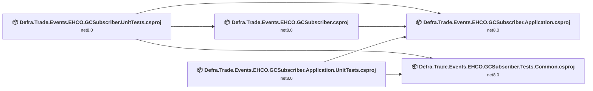
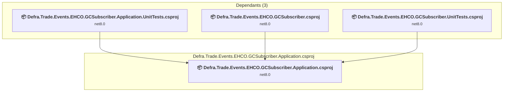
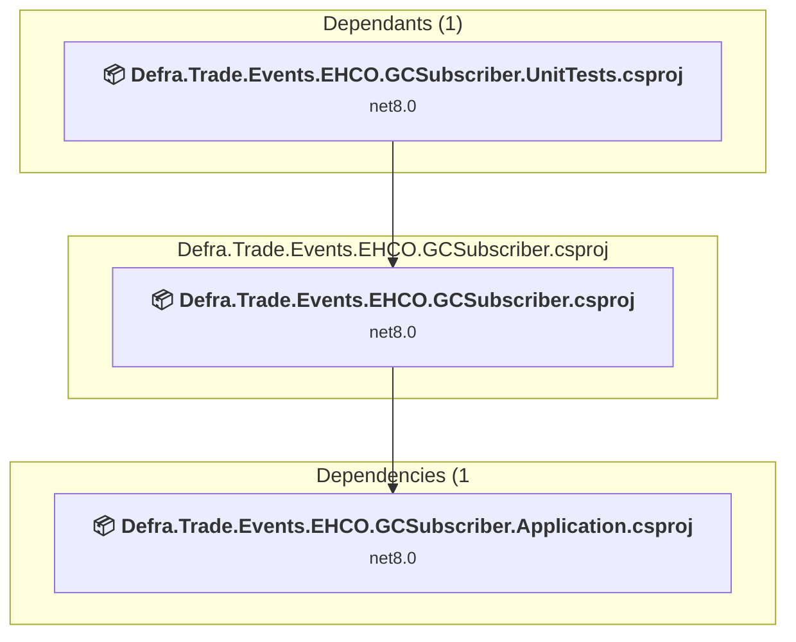
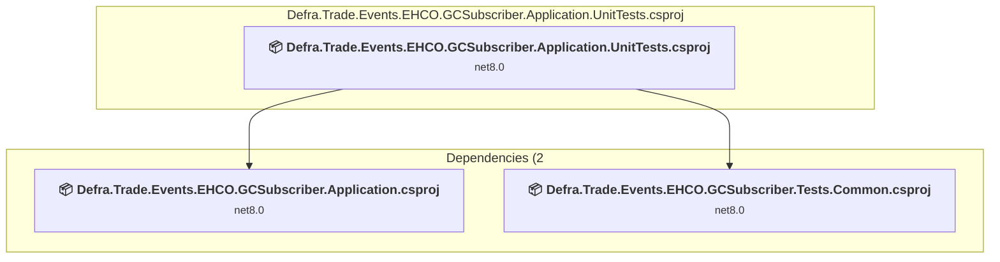
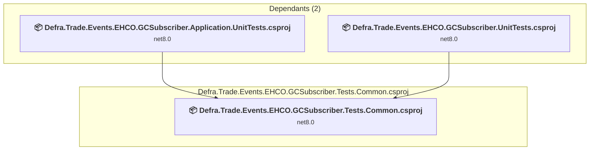
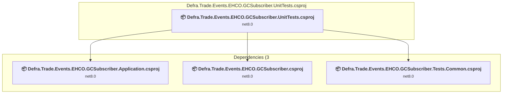

# Projects and dependencies analysis

This document provides a comprehensive overview of the projects and their dependencies in the context of upgrading to .NETCoreApp,Version=v10.0.

## Table of Contents

- [Executive Summary](#executive-Summary)
  - [Highlevel Metrics](#highlevel-metrics)
  - [Projects Compatibility](#projects-compatibility)
  - [Package Compatibility](#package-compatibility)
  - [API Compatibility](#api-compatibility)
- [Aggregate NuGet packages details](#aggregate-nuget-packages-details)
- [Top API Migration Challenges](#top-api-migration-challenges)
  - [Technologies and Features](#technologies-and-features)
  - [Most Frequent API Issues](#most-frequent-api-issues)
- [Projects Relationship Graph](#projects-relationship-graph)
- [Project Details](#project-details)

  - [src\Defra.Trade.Events.EHCO.GCSubscriber.Application\Defra.Trade.Events.EHCO.GCSubscriber.Application.csproj](#srcdefratradeeventsehcogcsubscriberapplicationdefratradeeventsehcogcsubscriberapplicationcsproj)
  - [src\Defra.Trade.Events.EHCO.GCSubscriber\Defra.Trade.Events.EHCO.GCSubscriber.csproj](#srcdefratradeeventsehcogcsubscriberdefratradeeventsehcogcsubscribercsproj)
  - [test\Defra.Trade.Events.EHCO.GCSubscriber.Application.UnitTests\Defra.Trade.Events.EHCO.GCSubscriber.Application.UnitTests.csproj](#testdefratradeeventsehcogcsubscriberapplicationunittestsdefratradeeventsehcogcsubscriberapplicationunittestscsproj)
  - [test\Defra.Trade.Events.EHCO.GCSubscriber.Tests.Common\Defra.Trade.Events.EHCO.GCSubscriber.Tests.Common.csproj](#testdefratradeeventsehcogcsubscribertestscommondefratradeeventsehcogcsubscribertestscommoncsproj)
  - [test\Defra.Trade.Events.EHCO.GCSubscriber.UnitTests\Defra.Trade.Events.EHCO.GCSubscriber.UnitTests.csproj](#testdefratradeeventsehcogcsubscriberunittestsdefratradeeventsehcogcsubscriberunittestscsproj)

## Executive Summary

### Highlevel Metrics

| Metric | Count | Status |
| :--- | :---: | :--- |
| Total Projects | 5 | All require upgrade |
| Total NuGet Packages | 27 | 7 need upgrade |
| Total Code Files | 55 |  |
| Total Code Files with Incidents | 10 |  |
| Total Lines of Code | 2563 |  |
| Total Number of Issues | 36 |  |
| Estimated LOC to modify | 16+ | at least 0.6% of codebase |

### Projects Compatibility

| Project | Target Framework | Difficulty | Package Issues | API Issues | Est. LOC Impact | Description |
| :--- | :---: | :---: | :---: | :---: | :---: | :--- |
| [src\Defra.Trade.Events.EHCO.GCSubscriber.Application\Defra.Trade.Events.EHCO.GCSubscriber.Application.csproj](#srcdefratradeeventsehcogcsubscriberapplicationdefratradeeventsehcogcsubscriberapplicationcsproj) | net8.0 | 🟢 Low | 3 | 0 |  | ClassLibrary, Sdk Style = True |
| [src\Defra.Trade.Events.EHCO.GCSubscriber\Defra.Trade.Events.EHCO.GCSubscriber.csproj](#srcdefratradeeventsehcogcsubscriberdefratradeeventsehcogcsubscribercsproj) | net8.0 | 🟢 Low | 7 | 6 | 6+ | ClassLibrary, Sdk Style = True |
| [test\Defra.Trade.Events.EHCO.GCSubscriber.Application.UnitTests\Defra.Trade.Events.EHCO.GCSubscriber.Application.UnitTests.csproj](#testdefratradeeventsehcogcsubscriberapplicationunittestsdefratradeeventsehcogcsubscriberapplicationunittestscsproj) | net8.0 | 🟢 Low | 1 | 0 |  | DotNetCoreApp, Sdk Style = True |
| [test\Defra.Trade.Events.EHCO.GCSubscriber.Tests.Common\Defra.Trade.Events.EHCO.GCSubscriber.Tests.Common.csproj](#testdefratradeeventsehcogcsubscribertestscommondefratradeeventsehcogcsubscribertestscommoncsproj) | net8.0 | 🟢 Low | 2 | 0 |  | DotNetCoreApp, Sdk Style = True |
| [test\Defra.Trade.Events.EHCO.GCSubscriber.UnitTests\Defra.Trade.Events.EHCO.GCSubscriber.UnitTests.csproj](#testdefratradeeventsehcogcsubscriberunittestsdefratradeeventsehcogcsubscriberunittestscsproj) | net8.0 | 🟢 Low | 1 | 10 | 10+ | DotNetCoreApp, Sdk Style = True |

### Package Compatibility

| Status | Count | Percentage |
| :--- | :---: | :---: |
| ✅ Compatible | 20 | 74.1% |
| ⚠️ Incompatible | 2 | 7.4% |
| 🔄 Upgrade Recommended | 5 | 18.5% |
| ***Total NuGet Packages*** | ***27*** | ***100%*** |

### API Compatibility

| Category | Count | Impact |
| :--- | :---: | :--- |
| 🔴 Binary Incompatible | 3 | High - Require code changes |
| 🟡 Source Incompatible | 13 | Medium - Needs re-compilation and potential conflicting API error fixing |
| 🔵 Behavioral change | 0 | Low - Behavioral changes that may require testing at runtime |
| ✅ Compatible | 3820 |  |
| ***Total APIs Analyzed*** | ***3836*** |  |

## Aggregate NuGet packages details

| Package | Current Version | Suggested Version | Projects | Description |
| :--- | :---: | :---: | :--- | :--- |
| AutoFixture | 4.18.1 |  | [Defra.Trade.Events.EHCO.GCSubscriber.Tests.Common.csproj](#testdefratradeeventsehcogcsubscribertestscommondefratradeeventsehcogcsubscribertestscommoncsproj) [Defra.Trade.Events.EHCO.GCSubscriber.UnitTests.csproj](#testdefratradeeventsehcogcsubscriberunittestsdefratradeeventsehcogcsubscriberunittestscsproj) | ✅Compatible |
| AutoFixture.AutoMoq | 4.18.1 |  | [Defra.Trade.Events.EHCO.GCSubscriber.Tests.Common.csproj](#testdefratradeeventsehcogcsubscribertestscommondefratradeeventsehcogcsubscribertestscommoncsproj) | ✅Compatible |
| AutoFixture.Idioms | 4.18.1 |  | [Defra.Trade.Events.EHCO.GCSubscriber.Tests.Common.csproj](#testdefratradeeventsehcogcsubscribertestscommondefratradeeventsehcogcsubscribertestscommoncsproj) | ✅Compatible |
| AutoFixture.Xunit2 | 4.18.1 |  | [Defra.Trade.Events.EHCO.GCSubscriber.Application.UnitTests.csproj](#testdefratradeeventsehcogcsubscriberapplicationunittestsdefratradeeventsehcogcsubscriberapplicationunittestscsproj) | ✅Compatible |
| AutoMapper | 13.0.1 | 16.1.1 | [Defra.Trade.Events.EHCO.GCSubscriber.Application.csproj](#srcdefratradeeventsehcogcsubscriberapplicationdefratradeeventsehcogcsubscriberapplicationcsproj) [Defra.Trade.Events.EHCO.GCSubscriber.Tests.Common.csproj](#testdefratradeeventsehcogcsubscribertestscommondefratradeeventsehcogcsubscribertestscommoncsproj) | NuGet package contains security vulnerability |
| Azure.Extensions.AspNetCore.Configuration.Secrets | 1.3.2 |  | [Defra.Trade.Events.EHCO.GCSubscriber.csproj](#srcdefratradeeventsehcogcsubscriberdefratradeeventsehcogcsubscribercsproj) | ✅Compatible |
| Azure.Identity | 1.12.0 |  | [Defra.Trade.Events.EHCO.GCSubscriber.csproj](#srcdefratradeeventsehcogcsubscriberdefratradeeventsehcogcsubscribercsproj) | ⚠️NuGet package is deprecated |
| Azure.ResourceManager | 1.13.0 |  | [Defra.Trade.Events.EHCO.GCSubscriber.csproj](#srcdefratradeeventsehcogcsubscriberdefratradeeventsehcogcsubscribercsproj) | ✅Compatible |
| Azure.Security.KeyVault.Certificates | 4.6.0 |  | [Defra.Trade.Events.EHCO.GCSubscriber.csproj](#srcdefratradeeventsehcogcsubscriberdefratradeeventsehcogcsubscribercsproj) | ✅Compatible |
| coverlet.collector | 6.0.2 |  | [Defra.Trade.Events.EHCO.GCSubscriber.Application.UnitTests.csproj](#testdefratradeeventsehcogcsubscriberapplicationunittestsdefratradeeventsehcogcsubscriberapplicationunittestscsproj) [Defra.Trade.Events.EHCO.GCSubscriber.Tests.Common.csproj](#testdefratradeeventsehcogcsubscribertestscommondefratradeeventsehcogcsubscribertestscommoncsproj) [Defra.Trade.Events.EHCO.GCSubscriber.UnitTests.csproj](#testdefratradeeventsehcogcsubscriberunittestsdefratradeeventsehcogcsubscriberunittestscsproj) | ✅Compatible |
| Defra.Trade.Common.Function.Health | 4.0.6 |  | [Defra.Trade.Events.EHCO.GCSubscriber.Application.csproj](#srcdefratradeeventsehcogcsubscriberapplicationdefratradeeventsehcogcsubscriberapplicationcsproj) | ✅Compatible |
| Defra.Trade.Common.Logging | 2.0.13 |  | [Defra.Trade.Events.EHCO.GCSubscriber.Tests.Common.csproj](#testdefratradeeventsehcogcsubscribertestscommondefratradeeventsehcogcsubscribertestscommoncsproj) | ✅Compatible |
| FunctionHealthCheck | 1.0.0 |  | [Defra.Trade.Events.EHCO.GCSubscriber.csproj](#srcdefratradeeventsehcogcsubscriberdefratradeeventsehcogcsubscribercsproj) | ✅Compatible |
| Microsoft.Azure.Functions.Worker.Extensions.Storage.Blobs | 6.6.0 |  | [Defra.Trade.Events.EHCO.GCSubscriber.Application.UnitTests.csproj](#testdefratradeeventsehcogcsubscriberapplicationunittestsdefratradeeventsehcogcsubscriberapplicationunittestscsproj) [Defra.Trade.Events.EHCO.GCSubscriber.Tests.Common.csproj](#testdefratradeeventsehcogcsubscribertestscommondefratradeeventsehcogcsubscribertestscommoncsproj) [Defra.Trade.Events.EHCO.GCSubscriber.UnitTests.csproj](#testdefratradeeventsehcogcsubscriberunittestsdefratradeeventsehcogcsubscriberunittestscsproj) | ✅Compatible |
| Microsoft.Extensions.Caching.Memory | 8.0.0 | 10.0.8 | [Defra.Trade.Events.EHCO.GCSubscriber.csproj](#srcdefratradeeventsehcogcsubscriberdefratradeeventsehcogcsubscribercsproj) | NuGet package upgrade is recommended |
| Microsoft.Extensions.Configuration.UserSecrets | 8.0.0 | 10.0.8 | [Defra.Trade.Events.EHCO.GCSubscriber.Application.csproj](#srcdefratradeeventsehcogcsubscriberapplicationdefratradeeventsehcogcsubscriberapplicationcsproj) [Defra.Trade.Events.EHCO.GCSubscriber.csproj](#srcdefratradeeventsehcogcsubscriberdefratradeeventsehcogcsubscribercsproj) | NuGet package upgrade is recommended |
| Microsoft.Extensions.Http | 8.0.0 | 10.0.8 | [Defra.Trade.Events.EHCO.GCSubscriber.csproj](#srcdefratradeeventsehcogcsubscriberdefratradeeventsehcogcsubscribercsproj) | NuGet package upgrade is recommended |
| Microsoft.Extensions.Logging | 8.0.0 | 10.0.8 | [Defra.Trade.Events.EHCO.GCSubscriber.Application.csproj](#srcdefratradeeventsehcogcsubscriberapplicationdefratradeeventsehcogcsubscriberapplicationcsproj) | NuGet package upgrade is recommended |
| Microsoft.NET.Sdk.Functions | 4.4.1 |  | [Defra.Trade.Events.EHCO.GCSubscriber.csproj](#srcdefratradeeventsehcogcsubscriberdefratradeeventsehcogcsubscribercsproj) | Needs to be replaced with Replace with new package Microsoft.Azure.Functions.Worker.Extensions.Http=3.3.0;Microsoft.Azure.Functions.Worker.Sdk=2.0.7;Microsoft.Azure.Functions.Worker=2.52.0 |
| Microsoft.NET.Test.Sdk | 17.11.1 |  | [Defra.Trade.Events.EHCO.GCSubscriber.Application.UnitTests.csproj](#testdefratradeeventsehcogcsubscriberapplicationunittestsdefratradeeventsehcogcsubscriberapplicationunittestscsproj) [Defra.Trade.Events.EHCO.GCSubscriber.Tests.Common.csproj](#testdefratradeeventsehcogcsubscribertestscommondefratradeeventsehcogcsubscribertestscommoncsproj) [Defra.Trade.Events.EHCO.GCSubscriber.UnitTests.csproj](#testdefratradeeventsehcogcsubscriberunittestsdefratradeeventsehcogcsubscriberunittestscsproj) | ✅Compatible |
| Moq | 4.18.4 |  | [Defra.Trade.Events.EHCO.GCSubscriber.Application.UnitTests.csproj](#testdefratradeeventsehcogcsubscriberapplicationunittestsdefratradeeventsehcogcsubscriberapplicationunittestscsproj) [Defra.Trade.Events.EHCO.GCSubscriber.Tests.Common.csproj](#testdefratradeeventsehcogcsubscribertestscommondefratradeeventsehcogcsubscribertestscommoncsproj) [Defra.Trade.Events.EHCO.GCSubscriber.UnitTests.csproj](#testdefratradeeventsehcogcsubscriberunittestsdefratradeeventsehcogcsubscriberunittestscsproj) | ✅Compatible |
| NJsonSchema | 11.0.2 |  | [Defra.Trade.Events.EHCO.GCSubscriber.csproj](#srcdefratradeeventsehcogcsubscriberdefratradeeventsehcogcsubscribercsproj) | ✅Compatible |
| Polly.Caching.Memory | 3.0.2 |  | [Defra.Trade.Events.EHCO.GCSubscriber.csproj](#srcdefratradeeventsehcogcsubscriberdefratradeeventsehcogcsubscribercsproj) | ✅Compatible |
| Shouldly | 4.2.1 |  | [Defra.Trade.Events.EHCO.GCSubscriber.Application.UnitTests.csproj](#testdefratradeeventsehcogcsubscriberapplicationunittestsdefratradeeventsehcogcsubscriberapplicationunittestscsproj) [Defra.Trade.Events.EHCO.GCSubscriber.Tests.Common.csproj](#testdefratradeeventsehcogcsubscribertestscommondefratradeeventsehcogcsubscribertestscommoncsproj) [Defra.Trade.Events.EHCO.GCSubscriber.UnitTests.csproj](#testdefratradeeventsehcogcsubscriberunittestsdefratradeeventsehcogcsubscriberunittestscsproj) | ✅Compatible |
| System.Net.Http | 4.3.4 |  | [Defra.Trade.Events.EHCO.GCSubscriber.csproj](#srcdefratradeeventsehcogcsubscriberdefratradeeventsehcogcsubscribercsproj) | NuGet package functionality is included with framework reference |
| xunit | 2.9.1 |  | [Defra.Trade.Events.EHCO.GCSubscriber.Application.UnitTests.csproj](#testdefratradeeventsehcogcsubscriberapplicationunittestsdefratradeeventsehcogcsubscriberapplicationunittestscsproj) [Defra.Trade.Events.EHCO.GCSubscriber.Tests.Common.csproj](#testdefratradeeventsehcogcsubscribertestscommondefratradeeventsehcogcsubscribertestscommoncsproj) [Defra.Trade.Events.EHCO.GCSubscriber.UnitTests.csproj](#testdefratradeeventsehcogcsubscriberunittestsdefratradeeventsehcogcsubscriberunittestscsproj) | ⚠️NuGet package is deprecated |
| xunit.runner.visualstudio | 2.8.2 |  | [Defra.Trade.Events.EHCO.GCSubscriber.Application.UnitTests.csproj](#testdefratradeeventsehcogcsubscriberapplicationunittestsdefratradeeventsehcogcsubscriberapplicationunittestscsproj) [Defra.Trade.Events.EHCO.GCSubscriber.Tests.Common.csproj](#testdefratradeeventsehcogcsubscribertestscommondefratradeeventsehcogcsubscribertestscommoncsproj) [Defra.Trade.Events.EHCO.GCSubscriber.UnitTests.csproj](#testdefratradeeventsehcogcsubscriberunittestsdefratradeeventsehcogcsubscriberunittestscsproj) | ✅Compatible |

## Top API Migration Challenges

### Technologies and Features

| Technology | Issues | Percentage | Migration Path |
| :--- | :---: | :---: | :--- |

### Most Frequent API Issues

| API | Count | Percentage | Category |
| :--- | :---: | :---: | :--- |
| T:System.BinaryData | 10 | 62.5% | Source Incompatible |
| T:Microsoft.Extensions.DependencyInjection.ServiceCollectionExtensions | 2 | 12.5% | Binary Incompatible |
| M:System.BinaryData.FromString(System.String) | 2 | 12.5% | Source Incompatible |
| M:Microsoft.Extensions.DependencyInjection.OptionsConfigurationServiceCollectionExtensions.Configure''1(Microsoft.Extensions.DependencyInjection.IServiceCollection,Microsoft.Extensions.Configuration.IConfiguration) | 1 | 6.3% | Binary Incompatible |
| M:System.BinaryData.ToString | 1 | 6.3% | Source Incompatible |

## Projects Relationship Graph

Legend:
📦 SDK-style project
⚙️ Classic project

## Project Details

### src\Defra.Trade.Events.EHCO.GCSubscriber.Application\Defra.Trade.Events.EHCO.GCSubscriber.Application.csproj

#### Project Info

- **Current Target Framework:** net8.0
- **Proposed Target Framework:** net10.0
- **SDK-style**: True
- **Project Kind:** ClassLibrary
- **Dependencies**: 0
- **Dependants**: 3
- **Number of Files**: 25
- **Number of Files with Incidents**: 1
- **Lines of Code**: 717
- **Estimated LOC to modify**: 0+ (at least 0.0% of the project)

#### Dependency Graph

Legend:
📦 SDK-style project
⚙️ Classic project

### API Compatibility

| Category | Count | Impact |
| :--- | :---: | :--- |
| 🔴 Binary Incompatible | 0 | High - Require code changes |
| 🟡 Source Incompatible | 0 | Medium - Needs re-compilation and potential conflicting API error fixing |
| 🔵 Behavioral change | 0 | Low - Behavioral changes that may require testing at runtime |
| ✅ Compatible | 1259 |  |
| ***Total APIs Analyzed*** | ***1259*** |  |

### src\Defra.Trade.Events.EHCO.GCSubscriber\Defra.Trade.Events.EHCO.GCSubscriber.csproj

#### Project Info

- **Current Target Framework:** net8.0
- **Proposed Target Framework:** net10.0
- **SDK-style**: True
- **Project Kind:** ClassLibrary
- **Dependencies**: 1
- **Dependants**: 1
- **Number of Files**: 8
- **Number of Files with Incidents**: 4
- **Lines of Code**: 370
- **Estimated LOC to modify**: 6+ (at least 1.6% of the project)

#### Dependency Graph

Legend:
📦 SDK-style project
⚙️ Classic project

### API Compatibility

| Category | Count | Impact |
| :--- | :---: | :--- |
| 🔴 Binary Incompatible | 3 | High - Require code changes |
| 🟡 Source Incompatible | 3 | Medium - Needs re-compilation and potential conflicting API error fixing |
| 🔵 Behavioral change | 0 | Low - Behavioral changes that may require testing at runtime |
| ✅ Compatible | 438 |  |
| ***Total APIs Analyzed*** | ***444*** |  |

### test\Defra.Trade.Events.EHCO.GCSubscriber.Application.UnitTests\Defra.Trade.Events.EHCO.GCSubscriber.Application.UnitTests.csproj

#### Project Info

- **Current Target Framework:** net8.0
- **Proposed Target Framework:** net10.0
- **SDK-style**: True
- **Project Kind:** DotNetCoreApp
- **Dependencies**: 2
- **Dependants**: 0
- **Number of Files**: 16
- **Number of Files with Incidents**: 1
- **Lines of Code**: 996
- **Estimated LOC to modify**: 0+ (at least 0.0% of the project)

#### Dependency Graph

Legend:
📦 SDK-style project
⚙️ Classic project

### API Compatibility

| Category | Count | Impact |
| :--- | :---: | :--- |
| 🔴 Binary Incompatible | 0 | High - Require code changes |
| 🟡 Source Incompatible | 0 | Medium - Needs re-compilation and potential conflicting API error fixing |
| 🔵 Behavioral change | 0 | Low - Behavioral changes that may require testing at runtime |
| ✅ Compatible | 1468 |  |
| ***Total APIs Analyzed*** | ***1468*** |  |

### test\Defra.Trade.Events.EHCO.GCSubscriber.Tests.Common\Defra.Trade.Events.EHCO.GCSubscriber.Tests.Common.csproj

#### Project Info

- **Current Target Framework:** net8.0
- **Proposed Target Framework:** net10.0
- **SDK-style**: True
- **Project Kind:** DotNetCoreApp
- **Dependencies**: 0
- **Dependants**: 2
- **Number of Files**: 3
- **Number of Files with Incidents**: 1
- **Lines of Code**: 88
- **Estimated LOC to modify**: 0+ (at least 0.0% of the project)

#### Dependency Graph

Legend:
📦 SDK-style project
⚙️ Classic project

### API Compatibility

| Category | Count | Impact |
| :--- | :---: | :--- |
| 🔴 Binary Incompatible | 0 | High - Require code changes |
| 🟡 Source Incompatible | 0 | Medium - Needs re-compilation and potential conflicting API error fixing |
| 🔵 Behavioral change | 0 | Low - Behavioral changes that may require testing at runtime |
| ✅ Compatible | 165 |  |
| ***Total APIs Analyzed*** | ***165*** |  |

### test\Defra.Trade.Events.EHCO.GCSubscriber.UnitTests\Defra.Trade.Events.EHCO.GCSubscriber.UnitTests.csproj

#### Project Info

- **Current Target Framework:** net8.0
- **Proposed Target Framework:** net10.0
- **SDK-style**: True
- **Project Kind:** DotNetCoreApp
- **Dependencies**: 3
- **Dependants**: 0
- **Number of Files**: 9
- **Number of Files with Incidents**: 3
- **Lines of Code**: 392
- **Estimated LOC to modify**: 10+ (at least 2.6% of the project)

#### Dependency Graph

Legend:
📦 SDK-style project
⚙️ Classic project

### API Compatibility

| Category | Count | Impact |
| :--- | :---: | :--- |
| 🔴 Binary Incompatible | 0 | High - Require code changes |
| 🟡 Source Incompatible | 10 | Medium - Needs re-compilation and potential conflicting API error fixing |
| 🔵 Behavioral change | 0 | Low - Behavioral changes that may require testing at runtime |
| ✅ Compatible | 490 |  |
| ***Total APIs Analyzed*** | ***500*** |  |

